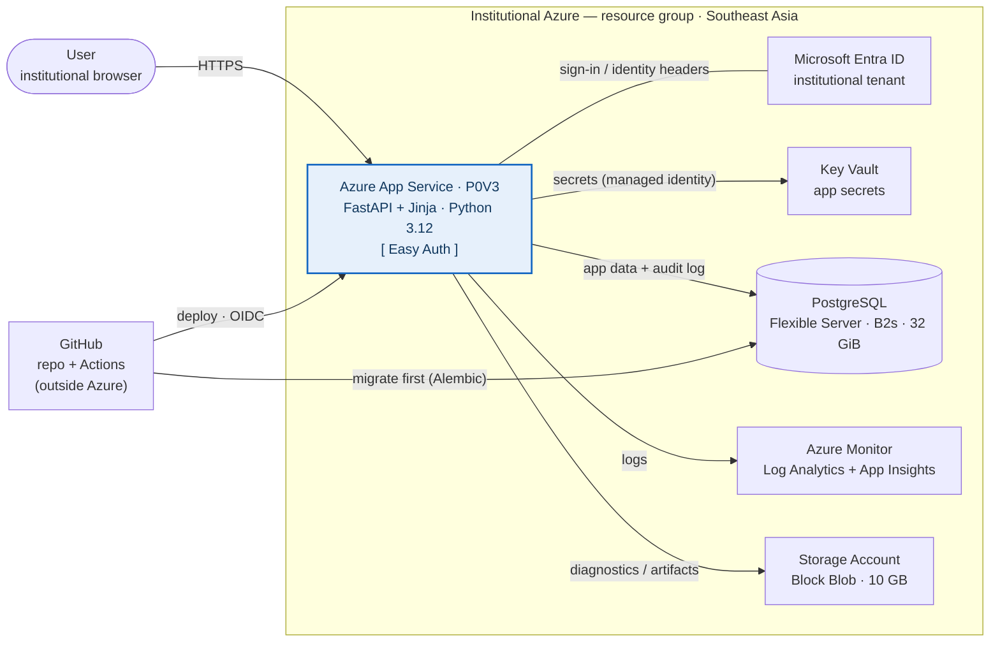

# Cloud architecture

The **deployment topology** of Review Robin Web (RRW) on institutional
Azure — what runs where, what talks to what, and what it costs. Written
for institutional IT.

> This is the *infrastructure* view. For the **application** architecture
> (domain entities, the route → service → model layering, audit-event
> model) see [`spec/architecture.md`](../spec/architecture.md).

RRW is a single server-rendered web app: it signs users in through
institutional Entra ID and stores everything in one managed PostgreSQL
database, deployed from GitHub with no stored cloud credentials. This is
the single sandboxed-pilot topology, sized for the current estimate
(≈ **$148 / month**, [§ Provisioned resources](#provisioned-resources)).

## Diagram

Runtime request path runs left to right: a browser reaches App Service
over HTTPS. **Easy Auth** delegates sign-in to Entra ID and hands the app
a verified identity — the application holds no passwords and runs no login
code. Everything the app persists lives in one PostgreSQL database inside a
single Azure resource group.

## Provisioned resources

Matches the current Azure pricing-calculator estimate (Southeast Asia,
Microsoft Customer Agreement, pay-as-you-go, monthly USD):

| Service | Tier / size | $ / mo |
|---|---|---:|
| App Service | Premium v3 · **P0V3** (1 vCPU, 4 GB) | 66.80 |
| Azure Database for PostgreSQL | Flexible Server · **Burstable B2s** (2 vCore) · 32 GiB | 80.34 |
| Storage Account | Block Blob · GPv2 · LRS · Hot · 10 GB | 1.24 |
| Key Vault | Standard | 0.03 |
| Azure Monitor | Log Analytics + Application Insights | 0.00 |
| **Total** | | **148.41** |

Summary estimate, not a quote. Reserved-instance / savings-plan discounts
on the always-on compute (App Service, Postgres) are not applied. For the
line-item calculator walk-through and the sizing rationale, see
[`azure_provision.md`](azure_provision.md).

## How the pieces fit

- **Identity.** Sign-in is **Microsoft Entra ID** via App Service Easy
  Auth. Easy Auth performs the OIDC flow and injects
  `X-MS-CLIENT-PRINCIPAL*` headers that `app/auth/identity.py` parses; the
  app implements no password store, no OAuth code, and makes no Microsoft
  Graph calls. See [`authentication.md`](authentication.md).
- **Data.** One **PostgreSQL Flexible Server**. Every mutating action
  writes an append-only `audit_events` row, so the database doubles as a
  compliance / incident-review record. See [`database.md`](database.md).
- **Secrets.** The database connection string lives in **Key Vault**; App
  Service reads it through its **system-assigned managed identity**, so no
  secret sits in the repository or in plaintext App Settings.
- **Deploy.** **GitHub Actions over OIDC federation** — no publish
  profiles or long-lived cloud credentials in GitHub. The pipeline is
  build → migrate → deploy; Alembic migrations run against Postgres
  *before* the App Service swap, so the app never ships against a stale
  schema.
- **Observability.** App Service streams structured JSON logs (with
  correlation IDs) to **Azure Monitor** (Log Analytics + Application
  Insights).
- **Storage.** A small **10 GB Block Blob** account for **diagnostics and
  deployment artifacts only** — the application itself has no blob
  dependency (CSV imports are parsed in-request, not persisted to blob).

## Deliberately absent

Not part of RRW's shape, so not in the topology or the estimate:

- **No WAF / Application Gateway** — the app's state-changing routes are
  all POST behind Easy Auth; add a gateway only if institutional policy
  mandates one in front of web apps.
- **No Azure SQL** — RRW is Postgres-only.
- **No Redis / cache tier** — the app holds no session or cache state
  outside Postgres.
- **No Front Door / CDN, no Static Web App** — server-rendered HTML, no
  separate frontend build.
- **No Container Registry** — deploy is a code push via
  `azure/webapps-deploy` (Oryx build on the platform), not a container
  image.

## Related documents

- [`azure_provision.md`](azure_provision.md) — the resource list as a
  pricing-calculator walk-through, with sizing rationale for larger
  reviews.
- [`azure_ask.md`](../azure_ask.md) — the governance ask (sponsorship,
  data policy, cost cap) for hosting on institutional Azure.
- [`azure_github_setup.md`](azure_github_setup.md) — the step-by-step
  build runbook that stands this topology up.
- [`security_posture.md`](security_posture.md) — authorization model,
  identity trust, CSRF posture.
- [`spec/architecture.md`](../spec/architecture.md) — the application
  (domain / layering) architecture.
