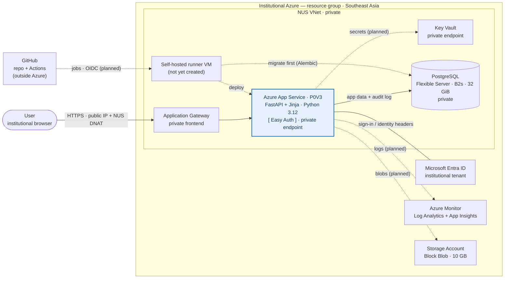

# Cloud architecture

The **deployment topology** of Review Robin Web (RRW) on institutional
Azure — what runs where, what talks to what, and what it costs. Written
for institutional IT.

> This is the *infrastructure* view. For the **application** architecture
> (domain entities, the route → service → model layering, audit-event
> model) see [`spec/architecture.md`](../spec/architecture.md).

RRW is a single server-rendered web app: it signs users in through
institutional Entra ID and stores everything in one managed PostgreSQL
database, deployed from GitHub with no stored cloud credentials. This is
the single sandboxed-pilot topology, sized for the current estimate
(≈ **$148 / month**, [§ Provisioned resources](#provisioned-resources)).

## Diagram

```mermaid
flowchart LR
    User(["User<br/>institutional browser"])
    GH["GitHub<br/>repo + Actions<br/>(outside Azure)"]

    subgraph AZ["Institutional Azure — resource group · Southeast Asia"]
        Entra["Microsoft Entra ID<br/>institutional tenant"]
        subgraph VNET["NUS VNet · private"]
            AGW["Application Gateway<br/>private frontend"]
            App["Azure App Service · P0V3<br/>FastAPI + Jinja · Python 3.12<br/>[ Easy Auth ] · private endpoint"]
            KV["Key Vault<br/>private endpoint"]
            PG[("PostgreSQL<br/>Flexible Server · B2s · 32 GiB<br/>private")]
            RUN["Self-hosted runner VM<br/>(not yet created)"]
        end
        MON["Azure Monitor<br/>Log Analytics + App Insights"]
        ST["Storage Account<br/>Block Blob · 10 GB"]
    end

    User -->|"HTTPS · public IP + NUS DNAT"| AGW
    AGW --> App
    App ---|"sign-in / identity headers"| Entra
    App -.->|"secrets (planned)"| KV
    App -->|"app data + audit log"| PG
    App -.->|"logs (planned)"| MON
    App -.->|"blobs (planned)"| ST
    GH -.->|"jobs · OIDC (planned)"| RUN
    RUN -.->|"deploy"| App
    RUN -.->|"migrate first (Alembic)"| PG

    classDef heart fill:#e6f0fb,stroke:#1668c1,stroke-width:2px,color:#12395f;
    class App heart;
```

Runtime request path runs left to right: a browser reaches a public IP,
which the NUS perimeter DNATs to the **Application Gateway**'s private
frontend; the gateway forwards to the Web App's **private endpoint**. The
Web App, PostgreSQL and Key Vault are private-only inside the NUS VNet,
and a self-hosted GitHub runner VM is planned in its own subnet so that
deploys and migrations can reach them. The verified state, addresses and
open blockers are in [`nus_azure_status.md`](nus_azure_status.md).
**Easy Auth** delegates sign-in to Entra ID and hands the app
a verified identity — the application holds no passwords and runs no login
code. Everything the app persists lives in one PostgreSQL database inside a
single Azure resource group.

## Provisioned resources

Matches the current Azure pricing-calculator estimate (Southeast Asia,
Microsoft Customer Agreement, pay-as-you-go, monthly USD):

| Service | Tier / size | $ / mo |
|---|---|---:|
| App Service | Premium v3 · **P0V3** (1 vCPU, 4 GB) | 66.80 |
| Azure Database for PostgreSQL | Flexible Server · **Burstable B2s** (2 vCore) · 32 GiB | 80.34 |
| Storage Account | Block Blob · GPv2 · LRS · Hot · 10 GB | 1.24 |
| Key Vault | Standard | 0.03 |
| Azure Monitor | Log Analytics + Application Insights | 0.00 |
| **Total** | | **148.41** |

Summary estimate, not a quote. It predates the NUS network design and
does not price the Application Gateway, its public IP or the runner VM.
Reserved-instance / savings-plan discounts
on the always-on compute (App Service, Postgres) are not applied. The
line-item calculator walk-through and the sizing rationale are kept in the
retired [`archive/azure_provision.md`](archive/azure_provision.md).

## How the pieces fit

- **Identity.** Sign-in is **Microsoft Entra ID** via App Service Easy
  Auth. Easy Auth performs the OIDC flow and injects
  `X-MS-CLIENT-PRINCIPAL*` headers that `app/auth/identity.py` parses; the
  app implements no password store, no OAuth code, and makes no Microsoft
  Graph calls. See [`security_posture.md`](security_posture.md).
- **Data.** One **PostgreSQL Flexible Server**. Every mutating action
  writes an `audit_events` row, so the database doubles as an
  incident-review record. Rows are never edited, but deleting a session
  deletes its rows, and so does purging its audit log; one event survives
  to record each (`session.deleted`, `session.audit_log_purged`). See
  [`database.md`](database.md).
- **Secrets.** A **Key Vault** is provisioned behind a private endpoint,
  but App Settings do not reference it yet: secrets live as plain App
  Settings and GitHub secrets today, and Key Vault references through a
  managed identity are deferred
  ([`security_posture.md`](security_posture.md), "Deferred hardening").
- **Deploy.** **GitHub Actions over OIDC federation** — no publish
  profiles or long-lived cloud credentials in GitHub. The pipeline is
  build → migrate → deploy; Alembic migrations run against Postgres
  *before* the package is deployed (straight to the `Production` slot;
  there is no slot swap), so the app never ships against a stale
  schema.
- **Observability.** The app writes structured JSON logs to stdout, one
  object per line (`app/logging_config.py`), which App Service's log
  stream shows. **Azure Monitor** (Log Analytics + Application Insights)
  is provisioned, but nothing sends the app's logs to it yet. Correlation
  IDs are stamped on `audit_events` rows and on a few log lines.
- **Storage.** A **10 GB Block Blob** account is provisioned and
  earmarked as the Segment 18Q blob store (`guide/segment_18Q_blob.md`);
  nothing uses it yet. The application has no blob dependency (CSV
  imports are parsed in-request, not persisted), and deploy artifacts
  travel as GitHub Actions artifacts, not through it.

## Deliberately absent

Not part of RRW's shape, so not in the topology or the estimate:

- **No Azure SQL** — RRW is Postgres-only.
- **No Redis / cache tier** — the app holds no session or cache state
  outside Postgres.
- **No Front Door / CDN, no Static Web App** — server-rendered HTML, no
  separate frontend build.
- **No Container Registry** — deploy is a code push via
  `azure/webapps-deploy`, not a container image. The workflow ships a
  prebuilt `antenv/` virtualenv in the package, so the platform does not
  re-run the build.

## Related documents

- [`azure_ask.md`](../azure_ask.md) — the governance ask (sponsorship,
  data policy, cost cap) for hosting on institutional Azure.
- [`nus_azure_status.md`](nus_azure_status.md) — the verified NUS
  state and its blockers, and [`deployment_nus.md`](deployment_nus.md),
  the runbook that deploys to it.
- [`security_posture.md`](security_posture.md) — authorization model,
  identity trust, CSRF posture.
- [`spec/architecture.md`](../spec/architecture.md) — the application
  (domain / layering) architecture.
